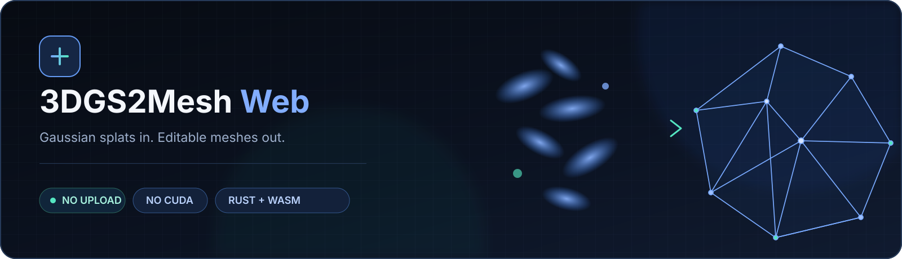
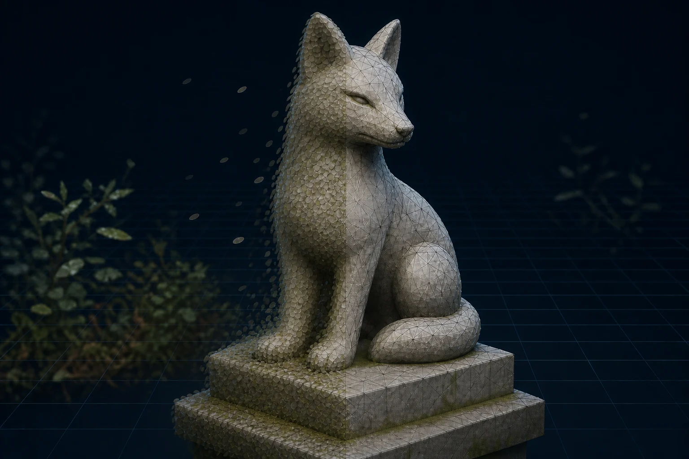

<p align="center"></p>

<p align="center">
  <a href="https://rsasaki0109.github.io/3dgs2mesh-web/"><strong>Open the live app</strong></a> ·
  <a href="docs/algorithm.md">Algorithm</a> ·
  <a href="docs/architecture.md">Architecture</a> ·
  <a href="CONTRIBUTING.md">Contributing</a>
</p>

<p align="center">
  <a href="https://github.com/rsasaki0109/3dgs2mesh-web/actions/workflows/ci.yml"></a>
  <a href="LICENSE"></a>
  
  
  
</p>

<p align="center"><strong>Convert PLY, SPZ, SPLAT, KSPLAT, and packaged SOG Gaussian splats into colored, editable triangle meshes—entirely inside your browser.</strong></p>

> [!IMPORTANT]
> This is an **approximate density-field reconstruction**, not an exact implementation of GS2Mesh, SuGaR, GOF, or FGGS-LiDAR. It does not promise research-grade geometric accuracy, manifoldness, or watertight output.

## Why 3DGS2Mesh Web?

| Private by design | Runs almost anywhere | Leaves you with a real mesh |
| --- | --- | --- |
| Your source stays on your device. No upload, account, analytics, or backend. | Static GitHub Pages app. No CUDA, Python, native install, or WASM threads. | Compare splat and mesh, clean components, smooth conservatively, then export GLB, PLY, or OBJ. |

Research pipelines such as GS2Mesh render stereo views and fuse learned depth, while GOF and related methods use training-time information. A static app receiving only one splat asset cannot reproduce those methods faithfully. This project focuses on the useful browser-native subset: anisotropic Gaussian density evaluation, spatial binning, deterministic iso-surface extraction, cleanup, and local export.

## From Gaussian splats to editable geometry

<p align="center"><a href="https://rsasaki0109.github.io/3dgs2mesh-web/"></a></p>

<p align="center"><sub>Concept visualization: one captured object represented as anisotropic Gaussian splats on the left and an editable triangle mesh on the right. This generated illustration is not a reconstruction-quality claim—open the live app to evaluate your own asset.</sub></p>

## From splat to mesh

```text
Local 3DGS asset
      │
      ▼
Parse + activate ──► robust bounds ──► 8³ spatial bins
                                            │
                                            ▼
GLB / PLY / OBJ ◄── repair + QEM ◄── density field (WebGPU, WASM, or slabs)
                                            │
                                            ▼
                                  Marching Tetrahedra
```

All expensive work runs in a dedicated module Worker. WebGPU accelerates tiled density evaluation when a compatible adapter is available; the single-threaded Rust/WASM path remains the deterministic fallback and requires no GPU compute.

## Highlights

| Area | What is included |
| --- | --- |
| **Input** | ASCII/binary little-endian PLY plus SPZ, SPLAT, KSPLAT, and packaged SOG |
| **Reconstruction** | Activated anisotropic Gaussians, visual crop box, robust bounds, sparse-tile culling, chunked WebGPU/WASM, and a bounded-memory CPU slab mode |
| **Mesh** | Topology-consistent Marching Tetrahedra, optional narrow-band signed distance, density denoise, outside flood fill, small-hole caps, Taubin smoothing, quadric-guided decimation, topology diagnostics |
| **Viewer** | Original / Mesh / Split modes, orbit controls, grid, axes, wireframe, shading, fit and reset |
| **Export** | Colored indexed GLB, binary little-endian PLY, and OBJ generated with local Blob URLs |
| **Safety** | Memory/device-limit checks, large-input warning, automatic Fast preset, progress, and cancellation by Worker termination |

## Privacy

The selected file is read by the browser and passed to a dedicated worker. It is never uploaded. Downloads use short-lived local Blob URLs. Spark receives local bytes for packed-format decoding and the optional preview; if preview initialization fails, a lightweight point preview is used and conversion continues.

> [!TIP]
> Want to try the complete pipeline without finding an asset first? Open the [live app](https://rsasaki0109.github.io/3dgs2mesh-web/) and choose **Load deterministic sample**.

## Supported input

| Format | v0.3 support |
| --- | --- |
| **PLY** | Independently parsed ASCII and `binary_little_endian` Graphdeco-style vertex data. Arbitrary scalar order is accepted. |
| **SPZ** | Packed Niantic SPZ decoded locally through Spark. SPZ v3 is continuously validated; current Spark decoding does not accept SPZ v4. |
| **SPLAT** | 32-byte Antimatter15-style records decoded locally through Spark. |
| **KSPLAT** | GaussianSplats3D packed files decoded locally through Spark. |
| **SOG** | Packaged PlayCanvas SOG ZIP using `.sog` or `.zip`, decoded locally through Spark. Loose multi-file SOG folders cannot be selected as one browser file. |

For PLY, required scalar properties are `x y z opacity scale_0 scale_1 scale_2 rot_0 rot_1 rot_2 rot_3`. Optional `f_dc_0`, `f_dc_1`, and `f_dc_2` provide approximate static color. Unknown normals, higher-order `f_rest_*`, and metadata are ignored. `binary_big_endian` and list properties inside `vertex` are rejected clearly.

Raw Graphdeco-style PLY values are activated as `exp(scale)`, `sigmoid(opacity)`, and normalized `(w,x,y,z)` quaternion. Packed formats enter the same meshing pipeline after Spark has decoded their activated center, scale, rotation, opacity, and base color. PLY color uses `clamp(0.5 + 0.28209479177387814 * f_dc, 0, 1)`. Higher-order spherical harmonics and view-dependent appearance are intentionally not preserved.

## Quick start

Prerequisites: current stable Node.js, current stable Rust, the `wasm32-unknown-unknown` target, and `wasm-pack`. Python is not required.

```bash
npm install
npm run dev
```

Useful commands:

```bash
npm run build       # wasm-pack (when available), typecheck, and Vite build
npm run test        # Vitest unit tests
npm run test:e2e    # Playwright smoke test
npm run test:e2e:browsers # Chromium, Firefox, and WebKit
npm run test:quality # opt-in local real-asset quality harness
npm run test:quality:compare # density versus signed-distance topology
npm run benchmark:summary # reviewed community GPU reports
npm run lint        # Biome formatting/lint checks
npm run typecheck
npm run check       # frontend checks plus Rust checks
```

The development and production builds both compile and use the Rust/WASM core. Install the target with `rustup target add wasm32-unknown-unknown` and install `wasm-pack` before running the root commands.

Maintainers can run the opt-in real-data diagnostics described in [docs/real-data-validation.md](docs/real-data-validation.md) and the structured [quality harness](docs/quality-validation.md). External fixtures remain local and are never committed.

## How the algorithm works

See [docs/algorithm.md](docs/algorithm.md) for equations. In short, the worker activates each Gaussian, rejects non-finite or weak splats, computes robust support bounds, bins support AABBs in a uniform grid, samples an anisotropic density field, selects a deterministic iso threshold, extracts a shared indexed surface with Marching Tetrahedra, then cleans and colors it.

## Parameter guide

| Preset | Longest dimension | Best starting point |
| --- | ---: | --- |
| **Fast** | ~64 | Large scenes, first passes, constrained devices |
| **Balanced** | ~96 | Default for small and medium object-centric assets |
| **Detailed** | ~160 | High-detail runs after a successful lower-resolution pass |

Higher resolution increases memory roughly with voxel count. Sigma radius controls support; opacity threshold removes weak splats; bounds quantile trims center outliers; the crop box limits conversion to a visible sub-volume. Density denoise removes isolated classifications, outside flood fill closes fully enclosed voids, and bounded boundary-loop caps repair small mesh holes. Optional **narrow-band signed distance** re-expresses repaired occupancy around its boundary before extraction; it is not camera-derived TSDF fusion. Mesh retention offers quadric-error-guided or vertex-clustering reduction. **Low-memory slab conversion** avoids retaining the complete density volume, but performs additional density passes and repeats them when iso changes. **Auto** prefers WebGPU and falls back to CPU/WASM; **WebGPU required** exposes adapter, device-loss, validation, and limit failures.

## GPU benchmark and real-data validation

**Run reproducible WebGPU benchmark** converts the deterministic bundled sample at a fixed Fast configuration. **Benchmark JSON** downloads adapter information, browser/CPU concurrency, parameters, stage timings, GPU validation error, and topology statistics locally. Nothing is submitted automatically. See [GPU benchmarking](docs/gpu-benchmarking.md), the [GPU compatibility issue template](.github/ISSUE_TEMPLATE/gpu_compatibility.yml), and [real-data quality validation](docs/quality-validation.md).

## Exports

GLB is indexed and includes normals, RGB vertex colors, and a vertex-color-aware material. Binary PLY includes positions, normals, RGB colors, and indexed faces. OBJ is included as a simple interoperability option and writes the common `v xyz rgb` convention.

## Known limitations

- This is a density-field approximation. It is not GS2Mesh, SuGaR, GOF, or FGGS-LiDAR and has no learned stereo/depth fusion.
- No camera/COLMAP loading, textures, texture baking, higher-order SH rendering, TSDF, or guaranteed watertight/manifold topology.
- Thin geometry, transparent/reflective surfaces, weakly observed regions, extreme scales, and very large scenes may reconstruct poorly or require cropping.
- Only SH DC color is used, so view-dependent appearance is lost.
- Packed inputs are quantized or compressed and may differ slightly from their source training PLY. SOG support is limited to a single packaged `.sog`/`.zip` file.
- WebGPU accelerates density sampling only. Spatial-bin construction, readback, extraction, repair, and export remain CPU work.
- Signed-distance stabilization uses a deterministic narrow band around thresholded occupancy. It is not a metric TSDF reconstructed from cameras or depth maps.
- Slab mode bounds resident density memory, but decoded Gaussians and the final mesh remain resident. Packed inputs are not yet decoded as an out-of-core stream.
- Outside flood fill requires the complete occupancy volume and is therefore disabled with a visible warning in slab mode.
- SPZ v4 currently produces an actionable unsupported-version error; use SPZ v3 or Graphdeco PLY.
- The preview adapter uses [Spark](https://github.com/sparkjsdev/spark) when available and falls back to colored points if initialization fails.

## Browser support and performance

Use a recent Chromium, Firefox, or Safari with WebAssembly and WebGL2. Chromium, Playwright Firefox, and Playwright WebKit smoke tests run in the compatibility workflow. WebGPU acceleration depends on browser, OS, driver, and device limits; unsupported devices automatically use CPU/WASM. The app reports only measurements produced on the current device. The repository intentionally contains no invented GPU results; reviewed community JSON reports can be summarized with `npm run benchmark:summary`.

## Architecture

```text
React UI ─────────────── Three.js / Spark viewer
   │
   └── module Worker ──► Spark packed-format decoder
          │
          ├── WebGPU tiled density ──► CPU extraction + repair
          ├── bounded CPU slabs ─────► merged slab surfaces
          └── mesh-wasm ─────────────► mesh-core
                 thin                   pure Rust
                 bindings               math + geometry + PLY export
```

React/TypeScript owns controls and state. A persistent module Worker decodes each source once, retains it for parameter changes, and returns at most 50,000 fallback-preview points. Spark normalizes packed formats. WebGPU uses bounded density chunks; CPU/WASM remains the fallback. `crates/mesh-core` contains browser-independent Rust math and exporters. Three.js owns the disposable viewer and crop-helper lifecycle. See [docs/architecture.md](docs/architecture.md).

## Roadmap

- **v0.2 — shipped:** bounded-memory density slabs, occupancy cleanup, outside flood fill, hole caps, quadric-guided reduction, quality harness, and reproducible GPU reports.
- **v0.3 — shipped:** topology-consistent tetrahedra cases, strict outside boundary handling, narrow-band signed-distance stabilization, sparse tile culling, mesh-health UI, and paired quality reports.
- **v0.4 — reconstruction:** adaptive/octree sampling, metric distance transforms, GPU-side bin construction, and genuinely streamed packed-format decoding.
- **v0.5 — camera-aware:** COLMAP import, rendered depth fusion, optional texture baking, comparisons with GS2Mesh/GOF-style approaches.

## Related work and references

This independent project uses the standard 3DGS PLY convention described by [3D Gaussian Splatting](https://github.com/graphdeco-inria/gaussian-splatting). Packed-format interoperability is provided by MIT-licensed [Spark](https://github.com/sparkjsdev/spark), with format origins documented by [SPZ](https://github.com/nianticlabs/spz), [SPLAT](https://github.com/antimatter15/splat), [KSPLAT/GaussianSplats3D](https://github.com/mkkellogg/GaussianSplats3D), and [PlayCanvas SOG](https://developer.playcanvas.com/user-manual/gaussian-splatting/formats/sog/). Conceptual references include [GS2Mesh](https://arxiv.org/abs/2404.01810), [Gaussian Opacity Fields](https://arxiv.org/abs/2404.10772), and [FGGS-LiDAR](https://arxiv.org/abs/2509.17390). An adjacent browser prototype is [Web-3DGS-to-PC](https://github.com/tatsuya-ogawa/Web-3DGS-to-PC). These references informed interoperability and high-level ideas only. No incompatible Graphdeco or academic implementation source code is copied. 3DGS2Mesh Web is not affiliated with the authors or maintainers of any of these projects.

## Contributing

Read [CONTRIBUTING.md](CONTRIBUTING.md), keep changes deterministic, add Rust or Vitest coverage for algorithm changes, and run `npm run check` before opening a pull request. Please include a small reproducible splat or synthetic test where relevant; never commit private assets.

Recommended GitHub topics: `3d-gaussian-splatting`, `gaussian-splatting`, `mesh-reconstruction`, `webassembly`, `rust`, `threejs`, `computer-vision`, `github-pages`.

## License

Code and original project documentation are Apache-2.0. Runtime dependencies and their licenses are listed in [THIRD_PARTY_NOTICES.md](THIRD_PARTY_NOTICES.md). This project is independent and is not affiliated with 3DGS, GS2Mesh, SuGaR, GOF, FGGS-LiDAR, Spark, or related projects.
