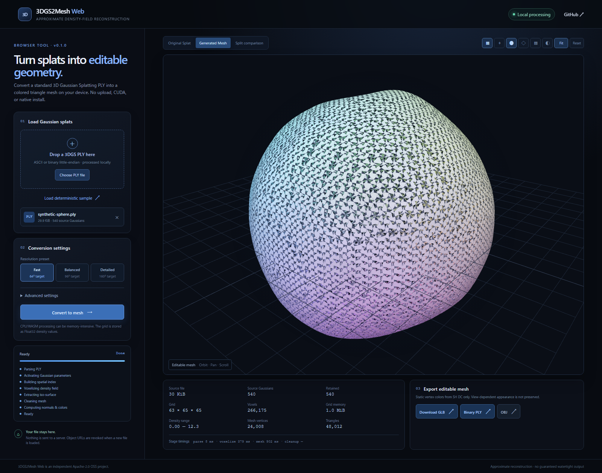

<p align="center"></p>

<p align="center">
  <a href="https://rsasaki0109.github.io/3dgs2mesh-web/"><strong>Open the live app</strong></a> ·
  <a href="docs/algorithm.md">Algorithm</a> ·
  <a href="docs/architecture.md">Architecture</a> ·
  <a href="CONTRIBUTING.md">Contributing</a>
</p>

<p align="center">
  <a href="https://github.com/rsasaki0109/3dgs2mesh-web/actions/workflows/ci.yml"></a>
  <a href="LICENSE"></a>
  
  
  
</p>

<p align="center"><strong>Convert standard 3D Gaussian Splatting PLY files into colored, editable triangle meshes—entirely inside your browser.</strong></p>

> [!IMPORTANT]
> This is an **approximate density-field reconstruction**, not an exact implementation of GS2Mesh, SuGaR, GOF, or FGGS-LiDAR. It does not promise research-grade geometric accuracy, manifoldness, or watertight output.

## Why 3DGS2Mesh Web?

| Private by design | Runs almost anywhere | Leaves you with a real mesh |
| --- | --- | --- |
| Your PLY stays on your device. No upload, account, analytics, or backend. | Static GitHub Pages app. No CUDA, Python, native install, or WASM threads. | Compare splat and mesh, clean components, smooth conservatively, then export GLB, PLY, or OBJ. |

Research pipelines such as GS2Mesh render stereo views and fuse learned depth, while GOF and related methods use training-time information. A static app receiving only one PLY cannot reproduce those methods faithfully. This project focuses on the useful browser-native subset: anisotropic Gaussian density evaluation, spatial binning, deterministic iso-surface extraction, cleanup, and local export.

## See it in action

<p align="center"><a href="https://rsasaki0109.github.io/3dgs2mesh-web/"></a></p>

<p align="center"><sub>Drop a PLY, compare Original Splat / Generated Mesh / Split, then export locally.</sub></p>

## From splat to mesh

```text
Local 3DGS PLY
      │
      ▼
Parse + activate ──► robust bounds ──► 8³ spatial bins
                                            │
                                            ▼
GLB / PLY / OBJ ◄── cleanup + color ◄── density field
                                            │
                                            ▼
                                  Marching Tetrahedra
```

All expensive work runs in a dedicated module Worker using a single-threaded Rust/WASM core, keeping the viewer and controls responsive.

## Highlights

| Area | What is included |
| --- | --- |
| **Input** | ASCII and binary little-endian 3DGS PLY, arbitrary scalar property order, actionable validation errors |
| **Reconstruction** | Activated anisotropic Gaussians, robust bounds, oriented support AABBs, tiled CPU density field, deterministic automatic iso |
| **Mesh** | Indexed Marching Tetrahedra, gradient normals, SH-DC colors, component filtering, conservative Taubin smoothing |
| **Viewer** | Original / Mesh / Split modes, orbit controls, grid, axes, wireframe, shading, fit and reset |
| **Export** | Colored indexed GLB, binary little-endian PLY, and OBJ generated with local Blob URLs |
| **Safety** | Memory estimate, large-input warning, automatic Fast preset, progress, and cancellation by Worker termination |

## Privacy

The selected file is read by the browser and passed to a dedicated worker. It is never uploaded. Download URLs are created locally and revoked after use. The optional Spark preview receives the same local object URL; if it cannot initialize, a lightweight point preview is used and conversion continues.

> [!TIP]
> Want to try the complete pipeline without finding a PLY first? Open the [live app](https://rsasaki0109.github.io/3dgs2mesh-web/) and choose **Load deterministic sample**.

## Supported input

Required scalar properties are `x y z opacity scale_0 scale_1 scale_2 rot_0 rot_1 rot_2 rot_3`. Optional `f_dc_0`, `f_dc_1`, and `f_dc_2` provide approximate static color. Unknown normals, higher-order `f_rest_*`, and metadata are ignored. ASCII and `binary_little_endian` are supported; `binary_big_endian` and list properties inside `vertex` are rejected clearly.

Raw Graphdeco-style values are activated as `exp(scale)`, `sigmoid(opacity)`, and normalized `(w,x,y,z)` quaternion. Color uses `clamp(0.5 + 0.28209479177387814 * f_dc, 0, 1)`. Higher-order spherical harmonics and view-dependent appearance are intentionally not preserved.

## Quick start

Prerequisites: current stable Node.js, current stable Rust, the `wasm32-unknown-unknown` target, and `wasm-pack`. Python is not required.

```bash
npm install
npm run dev
```

Useful commands:

```bash
npm run build       # wasm-pack (when available), typecheck, and Vite build
npm run test        # Vitest unit tests
npm run test:e2e    # Playwright smoke test
npm run lint        # Biome formatting/lint checks
npm run typecheck
npm run check       # frontend checks plus Rust checks
```

The development and production builds both compile and use the Rust/WASM core. Install the target with `rustup target add wasm32-unknown-unknown` and install `wasm-pack` before running the root commands.

Maintainers can run the opt-in real-PLY diagnostic described in [docs/real-data-validation.md](docs/real-data-validation.md). External fixtures remain local and are never committed.

## How the algorithm works

See [docs/algorithm.md](docs/algorithm.md) for equations. In short, the worker activates each Gaussian, rejects non-finite or weak splats, computes robust support bounds, bins support AABBs in a uniform grid, samples an anisotropic density field, selects a deterministic iso threshold, extracts a shared indexed surface with Marching Tetrahedra, then cleans and colors it.

## Parameter guide

| Preset | Longest dimension | Best starting point |
| --- | ---: | --- |
| **Fast** | ~64 | Large scenes, first passes, constrained devices |
| **Balanced** | ~96 | Default for small and medium object-centric assets |
| **Detailed** | ~160 | High-detail runs after a successful lower-resolution pass |

Higher resolution increases memory roughly with the number of voxels, not linearly with the displayed number. Sigma radius controls support (default 3); opacity threshold removes weak splats; bounds quantile trims center outliers from automatic bounds; iso can be automatic or manual; component filtering and conservative smoothing are optional. Expert resolutions up to 256 can be expensive and may be rejected before allocation. Inputs of at least 100 MiB or 500,000 source Gaussians select Fast automatically.

## Exports

GLB is indexed and includes normals, RGB vertex colors, and a vertex-color-aware material. Binary PLY includes positions, normals, RGB colors, and indexed faces. OBJ is included as a simple interoperability option and writes the common `v xyz rgb` convention.

## Known limitations

- This is a density-field approximation. It is not GS2Mesh, SuGaR, GOF, or FGGS-LiDAR and has no learned stereo/depth fusion.
- No camera/COLMAP loading, textures, texture baking, higher-order SH rendering, TSDF, denoising, outside flood fill, decimation, or guaranteed watertight/manifold topology.
- Thin geometry, transparent/reflective surfaces, weakly observed regions, extreme scales, and very large scenes may reconstruct poorly or require cropping.
- Only SH DC color is used, so view-dependent appearance is lost.
- The preview adapter uses [Spark](https://github.com/sparkjsdev/spark) when available and falls back to colored points if initialization fails.

## Browser support and performance

Use a recent Chromium, Firefox, or Safari with WebAssembly and WebGL2. Conversion runs in a dedicated single-threaded worker and does not require SharedArrayBuffer, COOP/COEP, CUDA, or GPU compute. Actual time and memory depend on Gaussian count, bounds, and device; the app reports measured stage timings and estimates grid memory without invented benchmarks.

## Architecture

```text
React UI ─────────────── Three.js / Spark viewer
   │
   └── module Worker
          │
          └── mesh-wasm ──► mesh-core
                 thin        pure Rust
                 bindings    math + geometry + PLY export
```

React/TypeScript owns controls and state. A module Web Worker owns parsing, activation, indexing, voxelization, extraction, cleanup, and transferable mesh buffers. `crates/mesh-core` contains browser-independent Rust math and exporters; `crates/mesh-wasm` exposes a staged binding. Three.js owns the disposable viewer lifecycle, while exporter modules produce local Blob downloads. See [docs/architecture.md](docs/architecture.md).

## Roadmap

- **v0.2 — faster:** WebGPU density backend, faster/chunked conversion, SPZ/SOG/SPLAT/KSPLAT inputs.
- **v0.3 — cleaner:** occupancy denoising, outside flood fill, narrow-band TSDF, more consistently closed meshes, decimation.
- **v0.4 — camera-aware:** COLMAP import, rendered depth fusion, optional texture baking, comparisons with GS2Mesh/GOF-style approaches.

## Related work and references

This independent project uses the standard 3DGS PLY convention described by [3D Gaussian Splatting](https://github.com/graphdeco-inria/gaussian-splatting). Conceptual references include [GS2Mesh](https://arxiv.org/abs/2404.01810), [Gaussian Opacity Fields](https://arxiv.org/abs/2404.10772), and [FGGS-LiDAR](https://arxiv.org/abs/2509.17390). The optional preview uses [Spark](https://github.com/sparkjsdev/spark); an adjacent browser prototype is [Web-3DGS-to-PC](https://github.com/tatsuya-ogawa/Web-3DGS-to-PC). These references informed interoperability and high-level ideas only. No incompatible Graphdeco or academic implementation source code is copied. 3DGS2Mesh Web is not affiliated with the authors or maintainers of any of these projects.

## Contributing

Read [CONTRIBUTING.md](CONTRIBUTING.md), keep changes deterministic, add Rust or Vitest coverage for algorithm changes, and run `npm run check` before opening a pull request. Please include a small reproducible PLY or synthetic test where relevant; never commit private assets.

Recommended GitHub topics: `3d-gaussian-splatting`, `gaussian-splatting`, `mesh-reconstruction`, `webassembly`, `rust`, `threejs`, `computer-vision`, `github-pages`.

## License

Code and original project documentation are Apache-2.0. Runtime dependencies and their licenses are listed in [THIRD_PARTY_NOTICES.md](THIRD_PARTY_NOTICES.md). This project is independent and is not affiliated with 3DGS, GS2Mesh, SuGaR, GOF, FGGS-LiDAR, Spark, or related projects.
